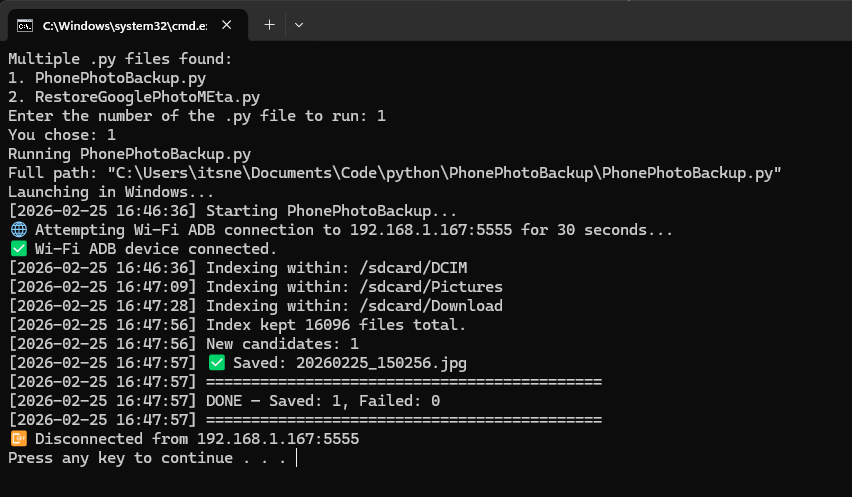
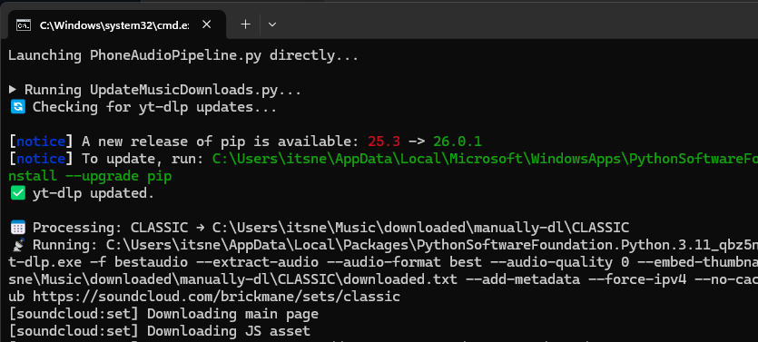

# SmartLaunch-Python 🚀

A modular, environment-aware Batch orchestrator for Python. Stop worrying about WSL pathing, terminal navigation, or swapping environments — just launch your code.

| 🔢 Interactive Selector (Multi-Script) | ⚡ Direct Launch (Hardcoded Mode) |
| :--- | :--- |
|  |  |

## 🌟 Features
*   **Dual-Environment:** Switch between Windows Native and WSL Linux by changing a single variable (`TRUE`/`FALSE`).
*   **Automatic Path Translation:** Converts Windows paths (`C:\Users\...`) to Linux mount points (`/mnt/c/...`) on the fly.
*   **Dynamic Intelligence:** 
    *   If 0 scripts found: Errors out gracefully.
    *   If 1 script found: Runs it instantly.
    *   If 1+ scripts found: Opens an interactive numbered selection menu.
*   **Power-User Mode:** Hardcode a specific script and arguments in the wrapper to bypass the menu for dedicated automations.
*   **Argument Forwarding:** Passes flags and parameters through to the final Python execution.

## 🛠 Setup & Installation

**1. Set up the Engine (SmartLaunch.bat)**
Download `SmartLaunch.bat` and place it in a dedicated scripts folder (e.g., `C:\Scripts\`). 
*Highly Recommended:* Add this folder to your Windows System `PATH` so you can call it globally without hardcoding directories.

**2. Set up the Trigger (launch.bat)**
Copy `launch.bat` into any of your Python project folders. This is the file you will double-click to run your code.

## 📖 Usage Examples

### The Dynamic Mode (Default)
Just drop `launch.bat` into a folder with Python scripts and run it. It will find your files and ask which one you want.

```batch
set launch_in_wsl=FALSE
call SmartLaunch.bat "%dir_path%" %launch_in_wsl%
```

### The Configured Mode (Hardcoded)
Perfect for specific tools where you always want to run the same file with specific arguments. Edit your `launch.bat` to define these overrides:

```batch
set "script_to_run=tts_client.py"
set "script_args=script.txt narration.wav"
call SmartLaunch.bat "%dir_path%" %launch_in_wsl% "%script_to_run%" %script_args%
```

## 📂 Project Structure
*   `SmartLaunch.bat`: The core logic engine (The Brain).
*   `launch.bat`: The local project wrapper (The Trigger).